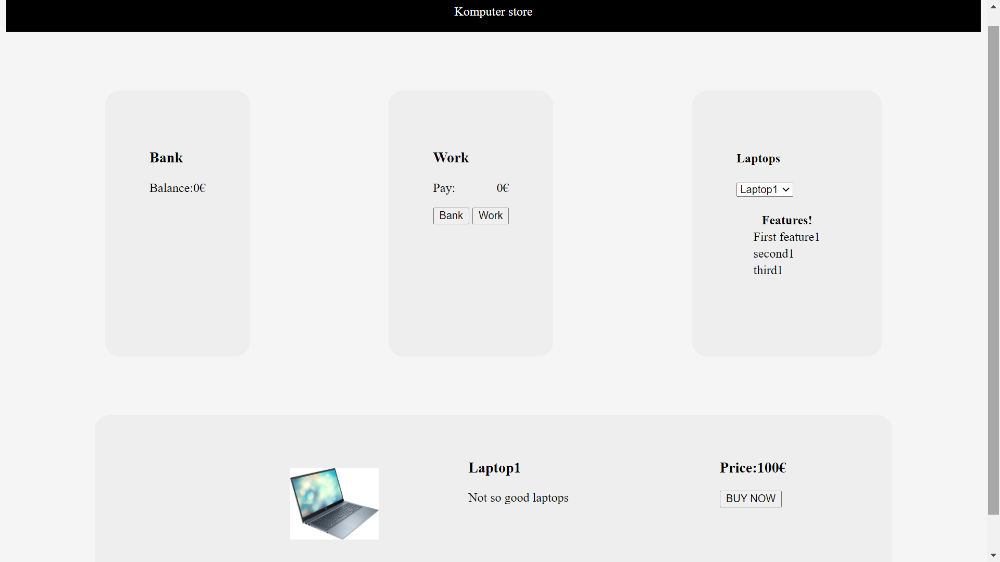
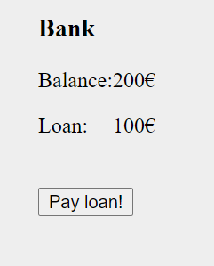
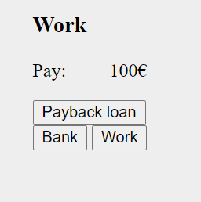
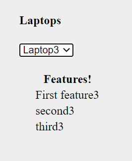
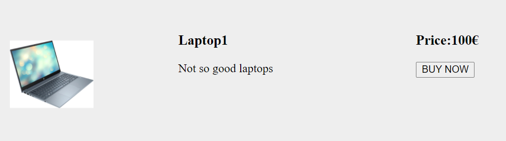

# Komputer store
Komputer store is part of Experis acedmy frontend cource.

Komputer store is a simple HTML/JavaScript application.

## Table of contents
- [Komputer store](#komputer-store)
  - [Table of contents](#table-of-contents)
  - [Description](#description)
    - [Bank](#bank)
    - [Work](#work)
    - [Info screen](#info-screen)
  - [Usage](#usage)
  - [Structure](#structure)

## Description
Full description of the task can be found [here](./documents/JavaScript_KomputerApp.pdf).

The Komputer store contains three modules. Bank, work and information.



### Bank



Bank is responsible to maintain users bank balance and issue loans.

There can be only one loan at time. User has to own a computer to get more than the first loan.
Maximum loan-amount is double the user bank balance.

Users bank balance is always shown to user.

The loan balance is only shown when user has a loan.

The Get loan! button is available when:
- users bank balance is bigger than 0
- user doesn't already have a loan
- user is able to take the first loan
- when user has a laptop (needed after the first loan)

It is hidden when user already has a loan.

The Pay loan! -button is available to user when the loan balance is bigger than 0.

### Work


User is able to work in order to earn money. Each click will increase pay with 100€. User has to transfer payment to bank in order to use them. 10% of pay is used to payback possible loan. User is also able to use all the available payment to pay back the loan. This "Payback loan" button is only available when user has a loan at the bank.

### Info screen


Info screen contains two parts. First part is used to choose a laptop. Features of chosen laptop are listed under selection.

Second part of the info screen shows a picture of the laptop with the laptop description.



User is able to buy the selected laptop using BUY NOW button. Buying laptop is only possible when user has enough money in their bank. After buying a laptop user is able to take a second loan.

## Usage
In order to run this application you should copy this repository and use [Live server](https://marketplace.visualstudio.com/items?itemName=ritwickdey.LiveServer) to run [index.html](./src/index.html).

## Structure
```
root
| README.m
| package.json
| package-lock.json
| |-documents
| | | pictures...
| | | full description of task
| |
| |-src
| | | index.html
| | | index.css
| | |-components
| | |   bank.js
| | |   work.js
| | |   laptops.js
| | |   DomManipulation.js
| | |   utils.js
```